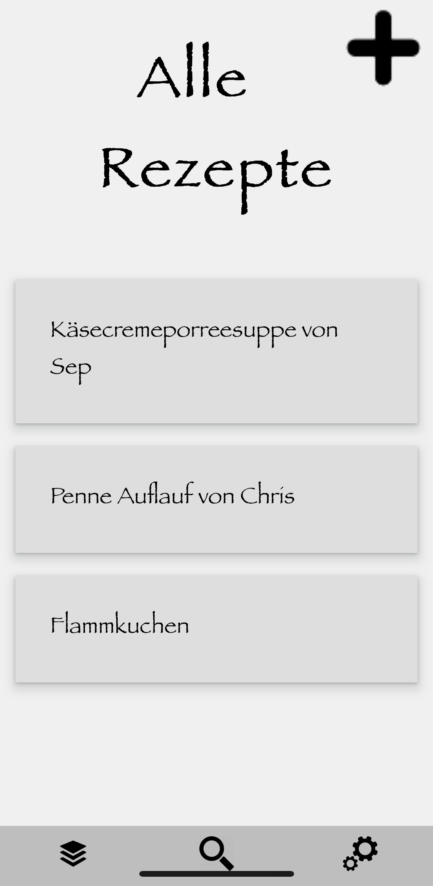

# Rezepte-PWA

## link for access: 
https://ysz0507.github.io/Rezepte-PWA/index.html

It's just a little PWA to save information ordered by a keyword.
Originally it was built to save your most liked recipes. Just click it and get the information.
Some other possible uses are:
<ul>
  <li>cookbook - save page and ingredients of recipes you like</li>
  <li>notepad - store some of the knowledge you earned</li>
  <li>bookshelve - save the names of the books that were recommended to you</li>
  <li>wishlist - save the ideas of the best presents for someone or for yourself</li>
  <li>walking - save your favourite routes</li>
  <li>and anything you can think of</li>
</ul>
But <b>don't</b> use it to save you passwords! It is <b>not</b> encrypted!

## License
 
    This 
    work
    by 
    Yves-Simon Zeulner 
    is licensed under a 
    <a rel="license" href="http://creativecommons.org/licenses/by-nc-sa/4.0/" target='_blank'>Creative Commons Attribution-NonCommercial-ShareAlike 4.0 International License</a>.

#### You are allowed to:
<table>
  <tr>
    <td>Share</td>
    <td>copy and redistribute the material in any medium or format</td>
  </tr>
  <tr>
    <td>Adapt</td>
    <td>remix, transform, and build upon the material</td>
  </tr>
</table>

#### But under the following terms:
<table>
  <tr>
    <td>Attribution</td>
    <td>You must give appropriate credit, provide a link to the license, and indicate if changes were made. You may do so in any reasonable manner, but not in any way that suggests the licensor endorses you or your use.</td>
  </tr>
  <tr>
    <td>NonCommercial</td>
    <td>You may not use the material for commercial purposes.</td>
  </tr>
  <tr>
    <td>ShareAlike</td>
    <td>If you remix, transform, or build upon the material, you must distribute your contributions under the same license as the original.</td>
  </tr>
</table>
